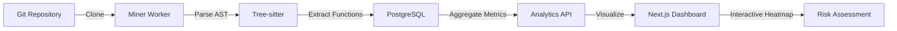

# FORGE 

**Code Entropy Engine** - Visualize complexity, track churn, identify technical debt.

[]()
[]()
[]()

FORGE analyzes your codebase using AST parsing to reveal high-risk files based on complexity and modification frequency. Built with FastAPI, Next.js, and Tree-sitter.


---

## ✨ Features

- 🔍 **Multi-Language AST Parsing** - Python, JavaScript, Java, Go
- 📊 **Interactive Heatmaps** - Visual risk assessment via treemaps
- 🔥 **Code Churn Analysis** - Track modification frequency over time
- 🎯 **Complexity Metrics** - Cyclomatic complexity per function
- 🔐 **Private Repository Support** - GitHub token authentication
- 🚀 **Production Ready** - Docker Compose orchestration
- ⚡ **Fast Queries** - Sub-second analytics on millions of records

---

## 🚀 Quick Start

### Prerequisites

- Docker & Docker Compose
- GitHub Personal Access Token (for private repos)

### 1. Clone & Setup

```bash
git clone https://github.com/abhijeetw035/FORGE.git
cd FORGE
cp .env.example .env
```

### 2. Configure GitHub Token

Edit `.env` and add your token:

```bash
GITHUB_TOKEN=ghp_your_token_here
```

<details>
<summary>How to get a GitHub token?</summary>

1. Go to [GitHub Settings → Developer settings → Personal access tokens](https://github.com/settings/tokens)
2. Click "Generate new token (classic)"
3. Select `repo` scope (for private repository access)
4. Copy the token and paste it in `.env`

</details>

### 3. Launch FORGE

```bash
docker-compose up -d
```

Services will start:
- 🌐 **Dashboard**: http://localhost:3000
- 🔌 **API**: http://localhost:8000
- 📊 **API Docs**: http://localhost:8000/docs

### 4. Analyze a Repository

```bash
curl -X POST http://localhost:8000/repositories/ \
  -H "Content-Type: application/json" \
  -d '{"url": "https://github.com/your-org/your-repo"}'
```

### 5. View Results

Open http://localhost:3000 and click "View Analysis" to see the entropy heatmap!

---

## 📊 How It Works



**The Algorithm:**
1. **Clone**: Repository cloned via GitPython
2. **Traverse**: All commits analyzed chronologically
3. **Parse**: AST extraction using Tree-sitter
4. **Extract**: Function-level metrics (LOC, complexity, parameters)
5. **Aggregate**: Calculate churn score (modification frequency)
6. **Visualize**: Treemap where size = LOC, color = risk level

---

## 🎯 Use Cases

### Engineering Managers
> "Which files have the most technical debt?"

**Answer**: FORGE highlights files with high churn + high complexity in red.

### Tech Leads
> "Where should I focus code review efforts?"

**Answer**: Large red boxes = high LOC + frequent changes = review priority.

### Architects
> "Is our system becoming more complex over time?"

**Answer**: Track entropy metrics across releases (coming in v2.0).

### Developers
> "Which modules are stable enough to refactor?"

**Answer**: Green boxes = low churn = safe to refactor.

---

## 🏗️ Architecture

```
┌──────────────────────────────────────────┐
│           FORGE Platform                 │
├──────────────────────────────────────────┤
│  Dashboard (Next.js 14)                  │
│  - Repository list                       │
│  - Interactive heatmaps                  │
│  - Real-time updates                     │
├──────────────────────────────────────────┤
│  API (FastAPI)                           │
│  - /repositories/* - CRUD                │
│  - /analytics/* - Aggregations           │
│  - Auto-generated docs                   │
├──────────────────────────────────────────┤
│  Miner Worker (Python)                   │
│  - Git operations (GitPython)            │
│  - AST parsing (Tree-sitter)             │
│  - Task queue (Redis)                    │
├──────────────────────────────────────────┤
│  Storage Layer                           │
│  - PostgreSQL 16 (relational)            │
│  - Redis 7 (queue)                       │
│  - Docker volumes (repos)                │
└──────────────────────────────────────────┘
```

---

## 📡 API Reference

### Submit Repository for Analysis

```bash
POST /repositories/
Content-Type: application/json

{
  "url": "https://github.com/owner/repo"
}
```

### Get Repository Status

```bash
GET /repositories/{id}
```

### Get Heatmap Data

```bash
GET /analytics/repositories/{id}/heatmap
```

Returns top 100 files:
```json
[
  {
    "name": "src/parser.py",
    "size": 1587,
    "score": 142
  }
]
```

**Metrics:**
- `size`: Total lines of code
- `score`: Number of modifications (churn)

---

## 🎨 Heatmap Interpretation

| Color | Risk Level | Meaning |
|-------|------------|---------|
| 🟢 Green | Low | Stable, infrequently modified |
| 🟡 Yellow | Moderate | Regular updates |
| 🟠 Orange | High | Frequent changes |
| 🔴 Red | Critical | Constantly evolving, high complexity |

**Box Size** = Total Lines of Code  
**Box Color** = Modification Frequency (Churn Score)

---

## 🛠️ Development

### Project Structure

```
forge/
├── api/                  # FastAPI backend
│   ├── routes/          # API endpoints
│   ├── models.py        # SQLAlchemy models
│   ├── database.py      # DB connection
│   └── alembic/         # Migrations
├── miner/               # Worker service
│   ├── services/        # Git, AST, Entropy
│   ├── worker.py        # Task processor
│   └── build_languages.py
├── dashboard/           # Next.js frontend
│   ├── src/
│   │   ├── app/         # Pages
│   │   ├── components/  # React components
│   │   ├── lib/         # API client
│   │   └── types/       # TypeScript types
└── docker-compose.yml   # Orchestration
```

### Tech Stack

**Backend**
- FastAPI 0.109.0
- SQLAlchemy 2.0.25
- PostgreSQL 16
- Redis 7

**Worker**
- Tree-sitter 0.21.3
- GitPython 3.1.41
- Python 3.11

**Frontend**
- Next.js 14
- TypeScript
- Tailwind CSS
- Recharts

### Running Tests

```bash
# API tests
docker-compose exec api pytest

# Check database
docker-compose exec api python check_db.py

# View logs
docker-compose logs -f miner
```

---

## 🔧 Configuration

### Environment Variables

| Variable | Description | Required |
|----------|-------------|----------|
| `GITHUB_TOKEN` | Personal access token for private repos | Optional* |
| `DATABASE_URL` | PostgreSQL connection string | Yes |
| `REDIS_URL` | Redis connection string | Yes |
| `STORAGE_PATH` | Path for cloned repositories | Yes |

*Required for private repositories

---

## 📈 Performance

- **Query Speed**: < 1 second for top 100 files
- **Scalability**: Tested with 3.3M+ function records
- **Concurrency**: Redis-based task queue (horizontally scalable)
- **Storage**: Efficient indexing on file paths and commit SHAs

---

## 🤝 Contributing

Contributions welcome! Please:

1. Fork the repository
2. Create a feature branch
3. Commit changes with clear messages
4. Submit a pull request

---

## 📄 License

MIT License - see LICENSE file for details

---

## 🙏 Acknowledgments

Built with:
- [Tree-sitter](https://tree-sitter.github.io/) - Parsing framework
- [FastAPI](https://fastapi.tiangolo.com/) - Modern Python API
- [Next.js](https://nextjs.org/) - React framework
- [Recharts](https://recharts.org/) - Charting library

---

## 📞 Support

- 🐛 **Issues**: [GitHub Issues](https://github.com/abhijeetw035/FORGE/issues)
- 📧 **Email**: abhijeetw035@gmail.com
- 💬 **Discussions**: [GitHub Discussions](https://github.com/abhijeetw035/FORGE/discussions)

---

**Made with 🔥 by Abhijeet Waghmare**

*"Every codebase tells a story. FORGE helps you read it."*
