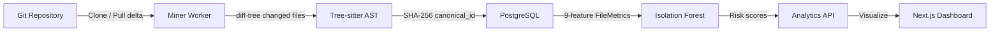

# FORGE

**Code Entropy Engine** — Visualize complexity, track churn, identify technical debt.

[]()
[]()
[]()

FORGE analyzes your codebase using AST parsing and machine learning to reveal high-risk files and track how functions evolve across commits. Built with FastAPI, Next.js, Tree-sitter, and Redis Streams.


---

## ✨ Features

- 🔍 **Multi-Language AST Parsing** — Python, JavaScript, Java, Go
- 📊 **Interactive Heatmaps** — Visual risk assessment via treemaps
- 🔥 **Code Churn Analysis** — Track modification frequency over time
- ⚙️ **Complexity Metrics** — Cyclomatic complexity per function
- 🧠 **9-Feature ML Risk Prediction** — Isolation Forest trained on churn, ownership entropy, file age, commit frequency, dependency count, and more
- 🔬 **Function Evolution Tracking** — SHA-256 AST identity hashing lets FORGE follow a function through moves, renames, and refactors
- ⚡ **Incremental Indexing** — Only new commits are scanned; a `last_indexed_sha` checkpoint avoids re-walking the full history
- 🛡️ **At-Least-Once Task Delivery** — Redis Streams with consumer groups; crashed workers are auto-recovered via `XAUTOCLAIM`
- 🔐 **Private Repository Support** — GitHub token authentication
---

## 🚀 Quick Start

### Prerequisites

- Docker & Docker Compose
- GitHub Personal Access Token (for private repos)

### 1. Clone & Setup

```bash
git clone https://github.com/abhijeetw035/FORGE.git
cd FORGE
cp .env.example .env
```

### 2. Configure GitHub Token

Edit `.env` and add your token:

```bash
GITHUB_TOKEN=ghp_your_token_here
```

<details>
<summary>How to get a GitHub token?</summary>

1. Go to [GitHub Settings → Developer settings → Personal access tokens](https://github.com/settings/tokens)
2. Click "Generate new token (classic)"
3. Select `repo` scope (for private repository access)
4. Copy the token and paste it in `.env`

</details>

### 3. Launch FORGE

```bash
docker-compose up -d
```

Services will start:
- 🌐 **Dashboard**: http://localhost:3000
- 🔌 **API**: http://localhost:8000
- 📊 **API Docs**: http://localhost:8000/docs

### 4. Analyze a Repository

```bash
curl -X POST http://localhost:8000/repositories/ \
  -H "Content-Type: application/json" \
  -d '{"url": "https://github.com/your-org/your-repo"}'
```

### 5. View Results

Open http://localhost:3000 and click **View Analysis** to explore the heatmap, function evolution timeline, and ML risk forecast.

---

## 📊 How It Works



**The Algorithm:**

1. **Clone or pull delta** — On first run the repo is cloned; subsequent runs use `git log <last_sha>..HEAD` to fetch only new commits
2. **Changed-files-only AST parsing** — Each commit's diff-tree limits Tree-sitter parsing to touched files (O(changed) instead of O(all))
3. **SHA-256 function identity hashing** — `canonical_id = SHA-256(signature_hash + ":" + body_hash)[:16]`; a function's identity survives moves and renames
4. **9-feature file metrics** — Churn, complexity, author count, lines added/deleted, commit frequency, recent churn, ownership entropy (Shannon), dependency count
5. **Isolation Forest anomaly detection** — `n_estimators=200`, `max_features=0.8`; files that deviate across all 9 axes get a high anomaly score
6. **Redis Streams task delivery** — `XADD` enqueues analysis tasks; `XREADGROUP`/`XACK` guarantee each task is processed at least once; `XAUTOCLAIM` re-delivers tasks from crashed workers after 60 s

---

## 🔬 Engineering Decisions

Four production-quality improvements were made to address real weaknesses:

### 1. ML Risk Prediction — beyond the simple formula

**Problem:** The original model used only 3 features (churn, complexity, author count) — essentially a weighted formula, not ML.

**Fix:** A `FileMetrics` table now stores 9 features per file. The Isolation Forest is retrained on every prediction request using all 9 axes:

| Feature | Why it matters |
|---------|---------------|
| `churn` | Raw modification count |
| `complexity` | Cyclomatic complexity |
| `author_count` | Bus-factor risk |
| `lines_added` | Growth indicator |
| `lines_deleted` | Instability indicator |
| `commit_frequency` | How often the file is touched |
| `recent_churn` | Last-30-day activity window |
| `ownership_entropy` | Shannon entropy across authors |
| `dependency_count` | Import surface area |

Files that are statistical outliers across all 9 axes receive the highest anomaly scores.

---

### 2. Function Identity — surviving moves and renames

**Problem:** Functions were tracked by file path + line number. Any rename, move, or reformat broke continuity and produced duplicate records.

**Fix:** Every function now has a `canonical_id = SHA-256(signature_hash + ":" + body_hash)[:16]`.

- **`signature_hash`** — `SHA-256("<lang>:<name>(<params>)")` — changes only on signature edits
- **`body_hash`** — `SHA-256(normalised_body)` — comments stripped, whitespace collapsed; changes only on semantic edits

A function moved across files, or reformatted, keeps the same `canonical_id`. An intentional rewrite gets a new one. The **Function Evolution** page in the dashboard groups all versions of a function across commits and highlights moves, renames, and growing complexity.

---

### 3. Incremental Git Indexing

**Problem:** Every analysis walked the entire commit history — catastrophic for repos with thousands of commits.

**Fix:** A `last_indexed_sha` column on the `Repository` model acts as a checkpoint.

```
first run : git log HEAD        → all commits
next run  : git log <sha>..HEAD → only new commits
```

- After each commit is processed the SHA is saved to DB, so a crash mid-run resumes correctly from the last checkpoint
- AST parsing is further limited to `diff-tree` changed files per commit

---

### 4. Redis Streams — at-least-once task delivery

**Problem:** The original queue used `LPUSH`/`BRPOP`. If the miner crashed between popping a task and finishing it, the task was lost forever.

**Fix:** Redis Streams with a consumer group:

```
XADD forge:tasks * payload <json>        # enqueue
XREADGROUP GROUP miner-workers worker-X  # dequeue (pending)
... process ...
XACK forge:tasks miner-workers <id>      # acknowledge success
XAUTOCLAIM forge:tasks miner-workers worker-X 60000 0-0  # reclaim stuck tasks
```

Tasks stay in the pending-entries list until explicitly acknowledged. After 60 seconds of idle time any unacknowledged task is reclaimed and re-delivered to an available worker. A `BLPOP` fallback handles Redis instances that don't support Streams.

---

## 🏗️ Architecture

```
┌────────────────────────────────────────────────────┐
│                  FORGE Platform                    │
├────────────────────────────────────────────────────┤
│  Dashboard (Next.js 14)                            │
│  - Repository list + status                        │
│  - Interactive heatmaps (Recharts treemap)         │
│  - Risk Forecast (9-feature ML scores)             │
│  - Function Evolution page (AST identity)          │
│  - Re-analyse button                               │
├────────────────────────────────────────────────────┤
│  API (FastAPI)                                     │
│  - /repositories/*        CRUD + reanalyze         │
│  - /analytics/heatmap     treemap data             │
│  - /analytics/risk-prediction   Isolation Forest   │
│  - /analytics/function-evolution  canonical_id     │
│  - Auto-generated OpenAPI docs                     │
├────────────────────────────────────────────────────┤
│  Miner Worker (Python)                             │
│  - Incremental git fetch (last_indexed_sha)        │
│  - diff-tree scoped AST parsing (Tree-sitter)      │
│  - SHA-256 canonical_id hashing                    │
│  - 9-feature FileMetrics extraction                │
│  - Redis Streams XREADGROUP / XACK / XAUTOCLAIM    │
├────────────────────────────────────────────────────┤
│  Storage Layer                                     │
│  - PostgreSQL 16  (repos, commits, functions,      │
│                    file_metrics — migrations 1-5)  │
│  - Redis Streams  (forge:tasks, miner-workers CG)  │
│  - Docker volumes (cloned repo storage)            │
└────────────────────────────────────────────────────┘
```

---

## 📡 API Reference

### Submit Repository for Analysis

```bash
POST /repositories/
Content-Type: application/json

{ "url": "https://github.com/owner/repo" }
```

### Get Repository Status

```bash
GET /repositories/{id}
```

### Trigger Full Re-analysis

```bash
POST /repositories/{id}/reanalyze
```

Wipes all derived data (functions, commits, file metrics) for the repo and re-queues it for a fresh analysis. Returns `409 Conflict` if the repo is already being analyzed.

### Get Heatmap Data

```bash
GET /analytics/repositories/{id}/heatmap
```

Returns top 100 files sorted by churn:

```json
[
  { "name": "src/parser.py", "size": 1587, "score": 142 }
]
```

- `size` — Total lines of code
- `score` — Number of modifications (churn)

### Get ML Risk Prediction

```bash
GET /analytics/repositories/{id}/risk-prediction
```

Returns Isolation Forest anomaly scores across all 9 features:

```json
[
  {
    "file_path": "src/core.py",
    "risk_score": 0.87,
    "churn": 142,
    "complexity": 38,
    "author_count": 7,
    "lines_added": 3200,
    "lines_deleted": 1800,
    "commit_frequency": 0.9,
    "recent_churn": 22,
    "ownership_entropy": 2.14,
    "dependency_count": 18
  }
]
```

### Get Function Evolution

```bash
GET /analytics/repositories/{id}/function-evolution?limit=50
```

Groups all versions of each function (by `canonical_id`) across the commit history:

```json
[
  {
    "canonical_id": "a3f1b9c2",
    "name": "parse_token",
    "file_path": "src/lexer.py",
    "commit_count": 14,
    "first_seen": "2023-01-10T09:00:00",
    "last_seen": "2024-03-22T15:30:00",
    "was_moved": true,
    "was_renamed": false,
    "complexity_trend": "increasing",
    "versions": ["..."]
  }
]
```

---

## 🎨 Heatmap Interpretation

| Color | Risk Level | Meaning |
|-------|------------|---------|
| 🟢 Green | Low | Stable, infrequently modified |
| 🟡 Yellow | Moderate | Regular updates |
| 🟠 Orange | High | Frequent changes |
| 🔴 Red | Critical | Constantly evolving, high complexity |

**Box Size** = Total Lines of Code  
**Box Color** = Modification Frequency (Churn Score)

---

## 🛠️ Development

### Project Structure

```
forge/
├── api/                  # FastAPI backend
│   ├── routes/           # repositories, analytics, auth
│   ├── services/         # predictor.py (Isolation Forest)
│   ├── models.py         # SQLAlchemy models
│   ├── database.py       # DB connection
│   └── alembic/          # Migrations 001-005
├── miner/                # Worker service
│   ├── services/         # git_service, ast_parser, entropy
│   ├── worker.py         # Redis Streams consumer loop
│   └── build_languages.py
├── dashboard/            # Next.js frontend
│   └── src/
│       ├── app/          # Pages (repositories, functions, …)
│       ├── components/   # RiskPrediction, Contributors, …
│       ├── lib/          # api.ts — typed API client
│       └── types/        # TypeScript interfaces
└── docker-compose.yml    # Orchestration
```

### Database Migrations

| Migration | Description |
|-----------|-------------|
| 001 | Initial schema (repositories, commits, functions) |
| 002 | Auth tables |
| 003 | `file_metrics` table (9 features) |
| 004 | `body_hash`, `signature_hash`, `canonical_id` on functions |
| 005 | `last_indexed_sha` on repositories |

### Tech Stack

**Backend**
- FastAPI 0.109.0
- SQLAlchemy 2.0.25
- scikit-learn (Isolation Forest)
- PostgreSQL 16
- Redis 7 (Streams)

**Worker**
- Tree-sitter 0.21.3
- GitPython 3.1.41
- Python 3.11
- hashlib (SHA-256)

**Frontend**
- Next.js 14 (App Router)
- TypeScript
- Tailwind CSS
- Recharts
- lucide-react

### Running Tests

```bash
# Check database state
docker-compose exec api python check_db.py

# View miner logs (shows stream consumer activity)
docker-compose logs -f miner

# View API logs
docker-compose logs -f api
```

---

## 🔧 Configuration

### Environment Variables

| Variable | Description | Required |
|----------|-------------|----------|
| `GITHUB_TOKEN` | Personal access token for private repos | Optional* |
| `DATABASE_URL` | PostgreSQL connection string | Yes |
| `REDIS_URL` | Redis connection string | Yes |
| `STORAGE_PATH` | Path for cloned repositories | Yes |

*Required for private repositories

---

## 📈 Performance

- **Query Speed**: < 1 second for top 100 files
- **Scalability**: Tested with 3.3M+ function records (217 K in `requests` alone)
- **Incremental indexing**: New commits only — no full re-walk after first analysis
- **Concurrency**: Redis Streams consumer groups (horizontally scalable workers)
- **Crash safety**: Unacknowledged tasks auto-reclaimed after 60 s idle

---

## 🤝 Contributing

Contributions welcome! Please:

1. Fork the repository
2. Create a feature branch
3. Commit changes with clear messages
4. Submit a pull request

---

## 📄 License

MIT License — see LICENSE file for details

---

## �� Acknowledgments

Built with:
- [Tree-sitter](https://tree-sitter.github.io/) — Parsing framework
- [FastAPI](https://fastapi.tiangolo.com/) — Modern Python API
- [scikit-learn](https://scikit-learn.org/) — Isolation Forest
- [Next.js](https://nextjs.org/) — React framework
- [Recharts](https://recharts.org/) — Charting library
- [Redis Streams](https://redis.io/docs/data-types/streams/) — At-least-once task delivery

---

## 📞 Support

- 🐛 **Issues**: [GitHub Issues](https://github.com/abhijeetw035/FORGE/issues)
- 📧 **Email**: abhijeetw035@gmail.com
- 💬 **Discussions**: [GitHub Discussions](https://github.com/abhijeetw035/FORGE/discussions)

---

**Made with 🔥 by Abhijeet Waghmare**

*"Every codebase tells a story. FORGE helps you read it."*
